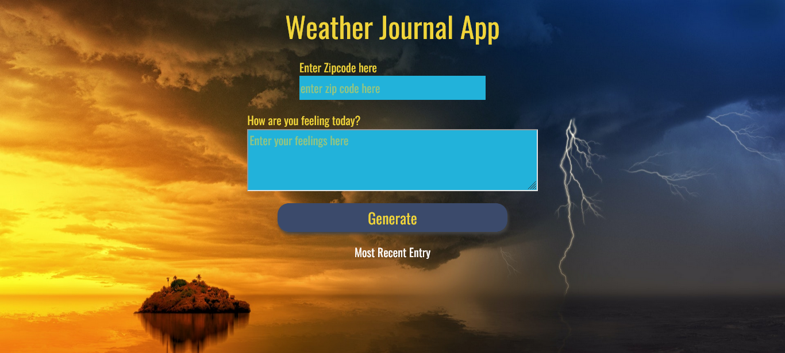
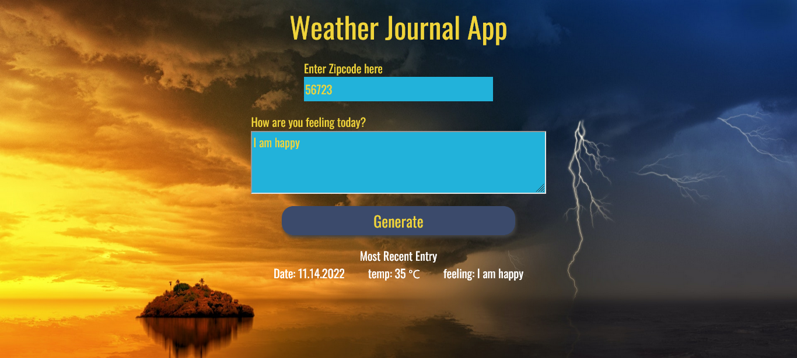

# Weather-Journal App Project

## Table of contents

- [Overview](#overview)
  - [The challenge](#the-challenge)
  - [Screenshot](#screenshot)
- [My process](#my-process)
  - [Built with](#built-with)
- [Author](#author)

## Overview

### The challenge

This project requires you to create an asynchronous web app that uses Web API and user data to dynamically update the UI.

### Screenshot

## My process

### Built with

- CSS custom properties
- Vanilla JS
- NodejS

## Author

- GitHub - [MohamedLebda](https://github.com/MohamedLebda)
